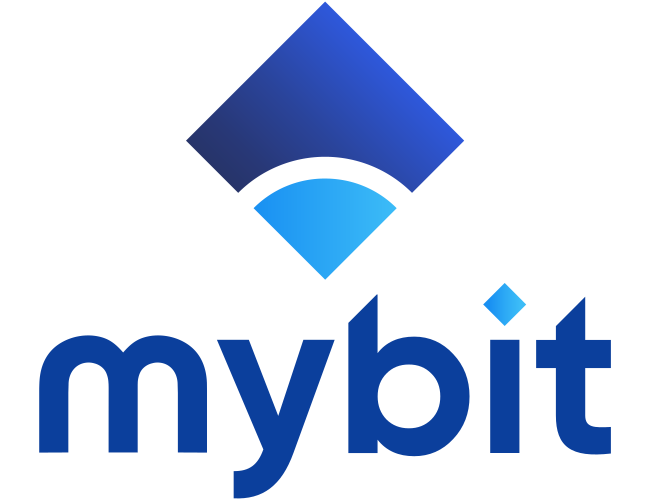

<p align="center">
  <a href="https://mybit.io/">
    
  </a>
</p>


# MyBitDapp-FrontEnd

[](https://circleci.com/gh/MyBitFoundation/MyBit-Go)

<br/>

🎨 The Front End that supports the MyBit Platform™

MyBit offers a fast, secure and cost-effective investing experience. Powered by Ethereum.

The MyBit Decentralized Application (DApp) enables anyone to invest directly in revenue generating assets.
<br/>

### Versions
>***0.0.1.alpha***
Note, this is an Alpha version which may not be well tested. Features in this version are not final.

- The Assets Funding Hub Contract Interface via web3
- ETH and MYB Account data view
- The Assets Portfolio and Revenue Contract Explorer
- [IPFS](https://github.com/ipfs) (A peer-to-peer hypermedia protocol) testflight

<br/><br/>

## Tools Used
#### [Now.sh](https://zeit.co/now)
#### [Next.js](https://nextjs.org/)
#### [Styled Components](https://www.styled-components.com/)
#### [Express](https://www.npmjs.com/package/express)

## Read before you contribute

### Environment Variables

Please create a `.env` file in the root of the project. See [here](https://en.wikipedia.org/wiki/Environment_variable) about environment variables.

Some of these env. variables are required, some aren't. Please read through each of them to understand what to do.

- REACT_APP_CIVIC_APP_ID | CIVIC_PRIVATE_KEY | CIVIC_APP_SECRET
Not required but civic won't work in a development environment, only once your PR is deployed to our server. Fortunately civic's API is good so you can use the current implementation anywhere you need it and trust it will work. Meanwhile Civic is disabled in dev.

- REACT_APP_INFURA_API_KEY (Prefix `REACT_` so it can be used in react code)
Free to generate at infura's [website](https://infura.io/). Required.

- BUCKET_REGION | AWS_ACCESS_KEY | BUCKET_NAME | AWS_SECRET_KEY
Currently the application won't work without these.

- AIRTABLE_KEY
Create a free account at [airtable](https://airtable.com) and copy [our table](https://airtable.com/shrpZZvivqhhoUbWn), then use your own [API key](url). Required.

### Contexts
The application is built around a series of Contexts (See [React Context](https://reactjs.org/docs/context.html)) in conjunction with [HOCs](https://reactjs.org/docs/higher-order-components.html) to provide different data to different components across the appliacation.

The following Contexts are available:

- [Metamask](https://github.com/MyBitFoundation/MyBit-Go.app/tree/develop/components/MetamaskContext/index.js)
- [Blockchain](https://github.com/MyBitFoundation/MyBit-Go.app/tree/develop/components/BlockchainContext.js)
- [Airtable](https://github.com/MyBitFoundation/MyBit-Go.app/tree/develop/components/Airtable.js)
- [Kyber](https://github.com/MyBitFoundation/MyBit-Go.app/tree/develop/components/KyberContext.js)
- [Notifications](https://github.com/MyBitFoundation/MyBit-Go.app/tree/develop/components/NotificationsContext.js)
- [Civic](https://github.com/MyBitFoundation/MyBit-Go.app/tree/develop/components/UI/CivicContext.js)

So if you need any of the information inside these contexts you can use the `with` high order component each of them provides.

### File Structure

### Patterns

### Styling

As said previously we use Styled Components but we also use a set of standards and a way to style inside the application. You will notice some of our files don't yet follow these standards, refactoring is gradually being done, these decisions were made recently.

#### Theme provider
We use Styled Components [Theme Provider](https://www.styled-components.com/docs/advanced#theming) component to have access to our own theme properties. See [this](https://github.com/csmartinsfct/MyBit-Go.app/blob/hotfix/refactoring/components/Theme/index.js) file with the declaration and an example of using it [here](https://github.com/csmartinsfct/MyBit-Go.app/blob/hotfix/refactoring/components/MobileMenu/styledMobileMenuWrapper.js).

#### Standards for naming
Each styled component is ideally declared inside its own file and for this reason the name of that file, say you are customising a button and your component is call `Navbar`then this new styled component file would be named `navBarButton.js`. So you keep the name of the Main component attached to each styled component file used inside it.

In this case the main styled component `Navbar` could be declared in a different file using `navBarWrapper.js` and then used inside `/NavBar/index.js` like so: ´<NavBarWrapper>´.

So the folder structure would be:
```
NavBar/index.js
NavBar/navBarWrapper.js
NavBar/navBarButton.js
```
<br/>

index.js:
```
<NavBarWrapper>
   <NavBarButton>
     Hello
  </NavBarButton>
</NavBarWrapper>
```

#### Standards for writing css
We use a mobile first approach. See more about it [here](https://zellwk.com/blog/how-to-write-mobile-first-css/).

See [this](https://itnext.io/thinking-in-styled-components-e230ea37c52c) document as a good reference on thinking in Styled Components.

### Server

### Global folders for your convenience
Using [babel](https://github.com/tleunen/babel-plugin-module-resolver).

The following folders are available from anywhere (but `/server`):
- static
- components
- constants
- utils
- ui

### User Documentation
MyBit Go follows user-centered design and documentation.
For User Flow docs check [this page](./TESTING.md).


## To run

### Installing the dependencies with [yarn](https://yarnpkg.com/en/docs/usage)
```sh
yarn install
```
### Development server
```sh
yarn dev
```

### Production server
```sh
yarn build
yarn now-start
```

### Powered with
<br/>
<p>

</p>
</p>

<br/><br/><br/>
<p align="center">
    <a href="https://www.youtube.com/watch?v=SGFGfpKn1dg">
        
    </a>
</a>
<br/>

<p align="center">
MyBit Platform™ CHE-177.186.963<br/>
</p>
